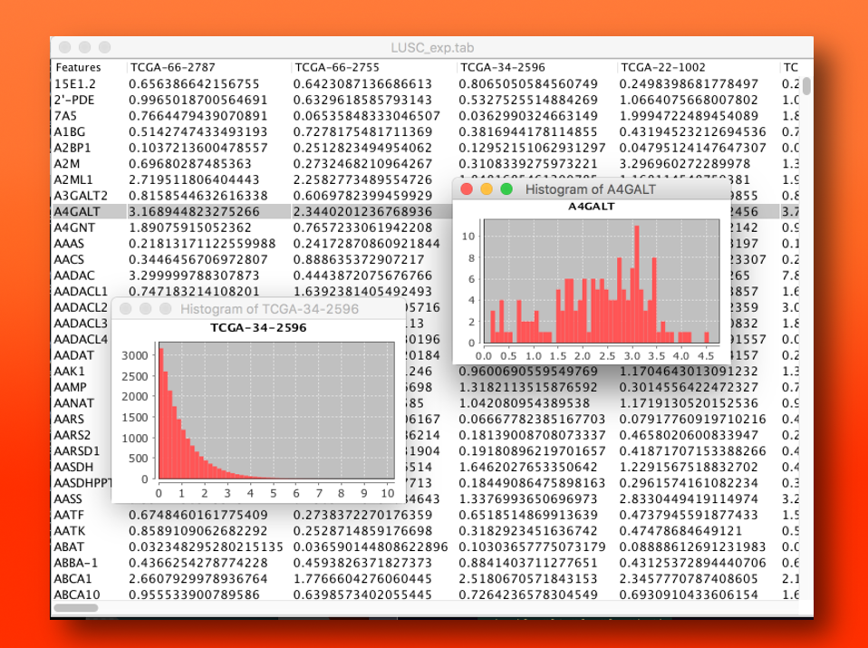

### Groovy Grapnel    

## About

**grapnel** is a collection of libraries and tools for data analysis tasks.  While **grapnel** is geared towards [Groovy](http://groovy.codehaus.org/), several tools are useful as stand alone-applications, and the **grapnel** libraries provide functionality that can be use in Java or any JVM based language as well.   I think of **grapnel** is the kitchen sink of Java/Groovy functionality that I use every day in my bioinformatics/machine learning research.   

## Installation

# Dependencies

The only dependencies for Grapnel are a newish version of Java (1.7 or later), a newish version of [Apache Ant](http://ant.apache.org/) (1.7 or later) and a newish version of [Apache Groovy](http://groovy-lang.org) (2.0 or later).   You can install these on your own machine wherever you like, just make sure all three are in your path.  

# Clone grapnel from github and build
Clone and build grapnel.jar:

```
git clone git://github.com/jdurbin/grapnel.git
cd grapnel
ant install
```
The install should build grapnel.jar and copy it and all required 3rd party jars, including weka, to grapnel/target.

# Set up Environment Variables

Set the CLASSPATH environment variable to include all the jars under grapnel/target/jar, and add the scripts
directory under grapnel to your path.  For example: 

```
export CLASSPATH="/Users/james/src/grapnel/target/jar/*"
export PATH=$PATH:/Users/james/src/grapnel/scripts/
```

It's useful, but not strictly necessary, to set the environment variable JAVA_OPTS to give more RAM to the JVM and to optimize for long-running jobs: 

```
export JAVA_OPTS="-Xmx6000m -server -Xss40m"
```

Type `csvsql` to test out the installation.  You should see the help message for csvsql. 

## Grapnel Scripts

* **scripts** Collection of command-line scripts (groovy). 
    * **[csvsql](https://github.com/jdurbin/grapnel/wiki/csvsql)**  Polished script based on [h2 database engine](http://www.h2database.com/) that lets you perform full SQL queries on csv table files (including joins on multiple files).  Some examples of things you can do with csvsql are:  
 
        ```sql
        csvsql "select score from people.csv where age < 40"
        csvsql "select name,score from people.csv where age <50 and score > 100"
        csvsql "select sum(score) from people.csv where age < 40"
        csvsql "select people.name,children.child from people.csv,children.csv where people.name=children.name"
        ```   

    * **viewtab** A BIG DATA spreadsheet.  Want to view data in a spreadsheet but spreadsheets choke on your 30,000 rows x 2,000 columns tables?  Then viewtab is for you!  View, sort data, plot histograms, scatter plot pairs of rows or columns.  Read more about it here: [viewtab] (http://bayesianconspiracy.blogspot.com/2012/06/quick-csvtab-file-viewer.html)
     
    * **cutbyname** Like cut, but cuts columns by column name. 
    * **rename** Rename batch of files based on regular expression find and replace. 
    * **tablesize**  How big is that csv/tab file in rows/columns? 

Some of the functionality is described in blog entries on my old blog at [The Bayesian Conspiracy](http://bayesianconspiracy.blogspot.com)


## grapnel.jar library includes:

* **grapnel.charts:**  Support for common kinds of charts: line chart, xyplot, hist.  Based on [JFreeChart](http://www.jfree.org/jfreechart/) but includes lots of sugar to make it easier to make commonly used charts and support for saving them in various formats. Also has support for creating a chart and displaying it in a GUI with a single command. 

* **grapnel.stat:**  Statistical classes.  
    * **MixtureModel** Class to compute parameters of a mixture model given data (based on [SSJ](http://www.iro.umontreal.ca/~simardr/ssj/indexe.html)), and to classify data into most-likely mixtures. 
    * **KolmogorovSmirnov** class to compute KolmogorovSmirnov statistics from data.<br><br>
    * **QuantileNormalization** classes to perform [quantile normalization] (https://en.wikipedia.org/wiki/Quantile_normalization)<br><br>
     * **Sampling** Wrappers to simplifying sampling from lists. <br><br> 
* **grapnel.util:** Core functionality of grapnel.  
    * **DoubleTable**  Implements a high-performance 2D table of doubles accessible by index or name. Backed by [colt] (http://acs.lbl.gov/software/colt/) DenseDoubleMatrix.  Includes syntatic sugar to allow [] notation, eachRow closures, etc. from Groovy and functionality to read/write tables to files in a fairly high performance way. 
    * **Table** Implements a fairly high-performance 2D object table.  Same functionality as DoubleTable generalized to a table of objects.  Not as efficient as DoubleTable for numeric data, but still fairly efficient.
    * **DynamicTable**  Implements a dynamically allocatable 2D table (a 2D Map, essentially).  Row and column keys can be any comparable object.  Backed by Google HashBasedTable in [guava](http://code.google.com/p/guava-libraries/)  Good performance with lots of Groovy syntax sugar. Read/write to file functionality.  
    * **MultidimensionalMap**  When a 2D Map isn't enough, MultidimensionalMap allows you to create HashMaps of arbitrary dimensions.  
    * **CounterMap**  Map that counts unique occurrences of keys.   
    * **FileUtils** Number of file utilities, fastCountLines, determineSeparator, etc. 
    * **ImageUtils** Utilities for saving AWT/Swing components as JPG/PNG/GIF images.  
    * **OnlineTable** Class to allow access to a tabular data file one-row-at-a-time by column name. 
    * **Parser** Class to parse options.  Fork of [Groovy Option Parser](http://code.google.com/p/groovy-option-parser/) to add better help support. 
    * **Perlism** Written to provide some functions found in Perl and missed by Perl colleagues. 
    * **RunBash** Class to support running bash scripts from Groovy like,  "ls -al".bash().  Actually runs the shell with the commands, so it supports wildcards, piping, and other things .execute() chokes on.  Even bash scripts can be run, like "for file in $(cat list.txt); do echo $file;done".bash()
    * **SSHPortForwarder** Class to do port forwarding from within Java/Groovy (say, for example, to access a database behind a firewall).  Based on [jsch](http://www.jcraft.com/jsch/).  <br><br>

* **grapnel.weka** Support for working with [Weka](http://www.cs.waikato.ac.nz/ml/weka/).  Lots of support for making an automated pipeline and for making trained classifiers into production-usable self-contained objects.  Perhaps most happily for weka library users, includes extensive support for instance IDs, including ability to access instances by ID.  Lots of functionality for accessing attributes and instances by name with [] notation in Groovy. Implements additional attribute selection and filter methods.  Forms the core of my machine learning automation package [wekaMine](http://jdurbin.github.com/wekaMine/). Some of the algorithms added to wekaMine include: 
    * **BalancedRandomForest** An implementation of a balanced random forest algorithm. 
    * **ExponentialNormalizationFilter** Normalize data by ranking and fitting to exponential distribution. 
    * **FishersLDEval** Attribute ranking based on Fisher's linear discriminant. 
    * **BimodalityIndexFilter** Model attributes as a mixture model, replace each value with a bimodality index based on that model.
<br><br>
* **swiftml** Collection of machine learning algorithms packaged nicely. Where wekaMine provides tools to easily automate large scale model selection/evaluation experiments, swiftml aims to provide a clean and easy to use interface to machine learning algorithms in the spirit of, for example, scikit-learn.  If you are looking for scikit-learn for Groovy/JVM swiftml might be what you need.  


---
